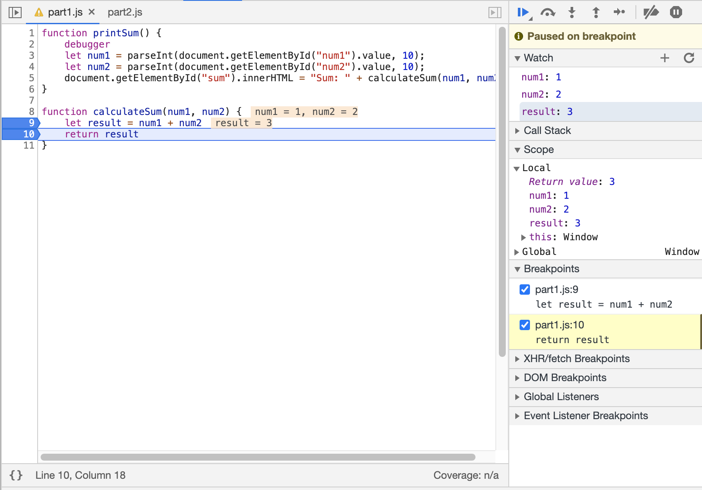

## Part 3

- What was the bug?

`num1` and `num2` were being assigned as strings, resulting in the addition operator concatenating `num2` onto the end of `num1` instead of them being numerically added together.

- How would you fix it? Include a screenshot of your fix.

I enclosed the assignment statements for `num1` and `num2` in the ParseInt function in order to correctly assign them int values corresponding to the input strings.

Once it finishes downloading, answer the following questions:

1. What is the name of the new json file?

citylots.json

2. Which file initiated the download of the new file?

part2.js

3. What is its file size?

11.7 MB

4. How long did it take to download?

7.1 seconds

Next, select that file to bring up a new side panel to answer the following:

5. What was your User-Agent for the browser that made the request?

Mozilla/5.0 (Macintosh; Intel Mac OS X 11_1_0) AppleWebKit/537.36 (KHTML, like Gecko) Chrome/88.0.4324.96 Safari/537.36

6. In the response, what type of server did it come from?

Apache

7. When was the file last modified?

Tue, 26 Jan 2021 22:14:13 GMT

8. What was the Content-Type of the file?

application/json

Navigate to the Initiator tab now and answer the last question

9. Which method inside the initiating file made the request?

fetch from within the function fetchData
